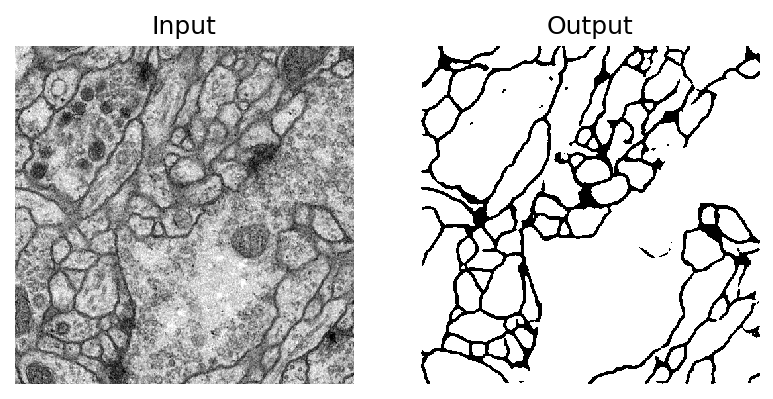

# Image segmentation with U-net
## General
This is a simple implementation of U-net architecture for image segmentation, which was proposed in:

*Olaf Ronneberger, Philipp Fischer, and Thomas Brox, "U-Net: Convolutional Networks for Biomedical Image Segmentation," Medical Image Computing and Computer-Assisted Intervention -- MICCAI 2015.*

### Dataset
The ISBI Challenge dataset: "Segmentation of neuronal structures in EM stacks" is used in this implementation. Input images and labels were loaded using tifffile package, then the data augmentation was conducted which is composed of rotation and flip.

### Training
```
python train.py
```
Training and validation loss:

### Testing
```
python test.py
```
Some experimental results:



